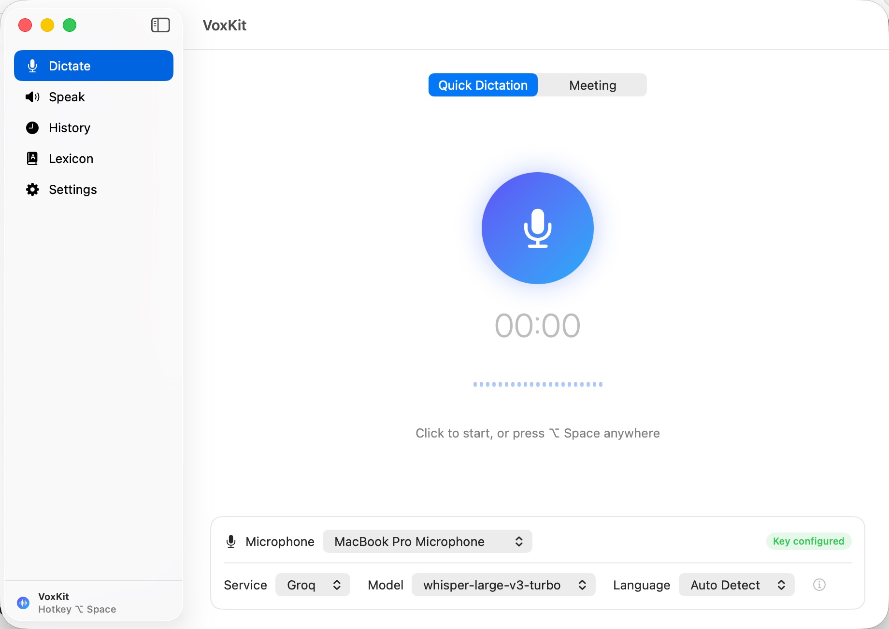

# VoxKit

> A lightweight macOS menu-bar app for speech-to-text and text-to-speech — press a
> hotkey anywhere, talk, and the transcript lands on your clipboard.


<p align="center">
  
</p>

VoxKit lives in your menu bar and stays out of the way. It is a small, native SwiftUI
app (~5 MB, no Electron, no background daemons) built by
[Zikai Xiong](https://zikaixiong.github.io) with Claude (Fable 5).
Interface in English, 简体中文, Español, Français, and 日本語.
Currently 0.x — it works well, but expect rough edges.

## Features

**Dictation, anywhere, with the model of your choice**
- Press the global hotkey (default `⌥ Space`) in any app, speak, press it again —
  the transcript is copied to your clipboard instantly, with optional auto-paste
- A floating review panel (resizable, never steals focus) lets you touch the text up,
  run a one-click AI proofread (`⌘J`), or just ignore it while you paste
- Pick your engine per task: Apple's on-device recognition (free, offline, live
  streaming text) or cloud models from OpenAI, Groq, SiliconFlow, AssemblyAI, and any
  OpenAI-compatible endpoint
- Quick Dictation and Meeting modes each remember their own service and model

**Meeting transcription**
- Long-form recording with pause/resume; transcription runs in the background
- Speaker diarization via AssemblyAI (`[02:15] Speaker A: …`), with hours-long audio
  handled in a single request
- For chunk-limited models, long recordings are split automatically at quiet points
  and merged back with timestamps
- Every recording is kept in a local library — re-transcribe with a different model
  any time, compare versions side by side, drag in external audio files
  (wav/mp3/m4a/aac/flac/aiff/caf) to transcribe them too

**Text-to-speech**
- A dedicated Speak page turns text into audio: system voices (free, offline,
  exportable) or OpenAI / Groq / SiliconFlow TTS models, with voice and speed controls
- Generated audio is saved automatically; replay, export, or speak it right away

**A lexicon that learns your vocabulary**
- Words you type while correcting transcripts become hotwords automatically; frequent
  words are mined from your history as one-click candidates
- Hotwords are injected into transcription prompts and AI proofreading, so names and
  technical terms come out spelled right — corrections are contextual, never blind
  find-and-replace

**Keys in the Keychain, data on your disk**
- API keys are stored in the **macOS Keychain** — never in files, never in logs
- All recordings, transcripts, and the lexicon stay in
  `~/Library/Application Support/VoxKit/`; no telemetry, no analytics, and no network
  traffic except the model requests you explicitly trigger

## Install

### Option 1 — download the app (no tools required)

1. Grab `VoxKit-<version>.zip` from [Releases](../../releases) and unzip it
2. Drag `VoxKit.app` into **Applications**
3. First launch: the app is not notarized (no Apple Developer subscription), so macOS
   blocks the first double-click —
   - **macOS 15+**: double-click once, then open *System Settings → Privacy & Security*,
     scroll down, click **Open Anyway**
   - **macOS 14 and earlier**: right-click the app → **Open** → **Open**
   - or clear the quarantine flag in Terminal: `xattr -cr /Applications/VoxKit.app`

### Option 2 — build from source

```bash
git clone https://github.com/zikaixiong/VoxKit.git
cd VoxKit
./build.sh            # compiles and packages dist/VoxKit.app
open dist/VoxKit.app
```

Only the Xcode Command Line Tools are required — the build script drives `swiftc`
directly, so there is no Xcode project and no package resolution step.
`./build.sh --zip` additionally produces a distributable zip. Signing and
notarization, if you have a Developer ID, are covered in
[DISTRIBUTION.md](DISTRIBUTION.md).

## Usage

1. **Set up a model** (optional) — on-device recognition works with zero setup. For
   cloud models, paste an API key under *Settings → API Keys*; check the ⓘ button next
   to the model pickers for prices and recommendations per scenario
2. **Dictate** — press `⌥ Space` anywhere, speak, press again. Watch the level meter
   bounce in the floating bar; the text is copied the moment recognition finishes
3. **Record a meeting** — switch to Meeting mode on the Dictate page; pause/resume as
   needed. The transcript appears in History with timestamps (and speakers, on
   AssemblyAI)
4. **Fix and teach** — edit any transcript in History (or in the post-dictation
   panel) and save; the words you introduced join your lexicon and improve future
   recognition
5. **Speak** — paste text into the Speak page, pick a voice, generate

## Permissions

VoxKit asks only for what each feature needs:

| Permission | When | Why |
|---|---|---|
| **Microphone** | first recording | capturing audio to transcribe |
| **Speech Recognition** | first on-device transcription | Apple's system recognizer processes your audio (offline when the language supports it) |
| **Accessibility** | only if you enable *auto-paste* | simulating `⌘V` into the frontmost app |

API keys are written to your login Keychain under the service
`com.zikai.voxkit` and are sent only as authorization headers to the service they
belong to. Nothing else leaves your machine.

## Supported services

| Service | Transcription | TTS | Notes |
|---|---|---|---|
| Apple (on-device) | ✓ live + file | ✓ system voices | free, offline, no key |
| OpenAI | ✓ | ✓ | gpt-4o(-mini)-transcribe, whisper-1, gpt-4o-mini-tts |
| Groq | ✓ | ✓ | whisper-large-v3(-turbo) — fastest cloud option |
| SiliconFlow | ✓ | ✓ | SenseVoice, CosyVoice2 — strong Chinese support |
| AssemblyAI | ✓ | — | speaker diarization, hours-long audio, no chunking |
| Custom | ✓ | ✓ | any OpenAI-compatible endpoint |

AI proofreading additionally works with Apple Intelligence on-device (macOS 26+) or
any of the chat-capable services above.

## Requirements

- macOS 13 Ventura or later, Apple Silicon
  (Intel: build from source with the `lipo` notes in DISTRIBUTION.md)

## Contributing

Issues and pull requests are welcome. The codebase is a single Swift module under
`Sources/VoxKit/` — `build.sh` is the whole build system.

## License

[MIT](LICENSE) © 2026 Zikai Xiong
